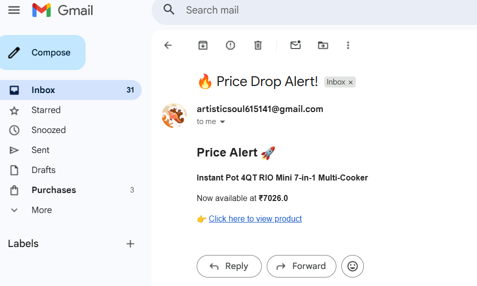

🚀 Deal Finder -- Amazon Price Tracker with Email Alerts
=======================================================

A Python-based automation project that tracks product prices from Amazon and sends an email alert when the price drops below your target value.

* * * * *

📌 Project Overview
-------------------

This project scrapes real-time product data from Amazon and notifies the user via email when a deal is available. It is a practical implementation of web scraping, automation, and email integration.

* * * * *

⚙️ Features
-----------

-   🔍 Scrapes live product data from Amazon
-   💰 Tracks price and compares with target price
-   📧 Sends automated email alerts
-   ⏰ Automated to run daily using Task Scheduler / GitHub Actions

* * * * *

🛠️ Tech Stack
--------------

-   Python
-   requests
-   BeautifulSoup (bs4)
-   smtplib
-   email.message

* * * * *

📂 Project Structure
--------------------

deal-finder/\
│── main.py\
│── .env\
│── config.py\
│── README.md

* * * * *

🔑 Setup Instructions
---------------------

### 1\. Clone the Repository

git clone https://github.com/Manglam11/deal_finder.git\
cd deal-finder

* * * * *

### 2\. Install Dependencies

pip install requests beautifulsoup4 python_dotenv

* * * * *

### 3\. Configure Environment Variables

Create a `config.py` file:

MY_MAIL = "your_email@gmail.com"\
APP_PASSWORD = "your_app_password"\
SMTP_ADDRESS = "smtp.gmail.com"

⚠️ Use **App Password**, not your real email password.

* * * * *

### 4\. Run the Script

`python main.py`

* * * * *

🧠 How It Works
---------------

1.  Sends a request to the product page
2.  Parses HTML using BeautifulSoup
3.  Extracts:
    -   Product Title
    -   Product Price
4.  Cleans and shortens the title
5.  Compares price with target value
6.  Sends an HTML email alert if condition is met

* * * * *

📸 Sample Email Output
----------------------

* * * * *

⚠️ Disclaimer
-------------

-   Amazon may block scraping requests or change page structure
-   This project is for **educational purposes only**
-   Use responsibly and avoid sending too many requests
* * * * *

